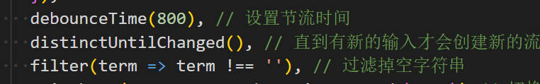
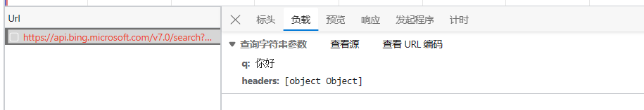
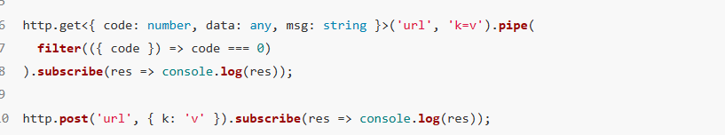
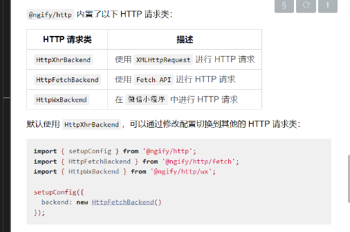

[toc]

## Rx.js 的概念和个人理解

[rxjs](https://rxjs.tech/guide/observable)，从本质上来说就是用来操作流的工具库，什么是流呢，比如说在一个在线学堂，我的观众数，提问数之类的数据都不是一开始就有的，而是随着时间产生的，那么这些数据集就是流，Rxjs 就是为了处理这些流而产生的工具，可以进行流的截断(unsubscribe),延迟(setTimeout),防抖(debounceTime)。
而且 rxjs 的流是同步的，但是互相独立的，互相不干扰的。
RxJS 是一个用于处理异步事件流的库
**可以将 RxJS 视为处理事件的 Lodash。**
看到的超赞的[blog1](https://juejin.cn/post/7090422222195523621#heading-13) [blog2](https://juejin.cn/post/7003328753556258846)
RxJS 中解决异步事件管理的基本概念有：

- **Observable（可观察者）**：表示未来（future）值或事件的可调用集合的概念。

- **Observer（观察者）**：是一个回调集合，它知道如何监听 Observable 传来的值。

- **Subscription（订阅）**：表示 Observable 的一次执行，主要用于取消执行。

- **Operator（操作符）**：是纯函数，可以使用 map、filter、concat、reduce 等操作来以函数式编程风格处理集合。

- **Subject（主体）**：相当于一个 EventEmitter，也是将一个值或事件多播到多个 Observers 的唯一方式。

- **Scheduler（调度器）**：是控制并发的集中化调度器，允许我们在计算发生时进行协调，例如 setTimeout 或 requestAnimationFrame 或其它。

## Observables

可以理解为是流，数据流的集合，但是和它和函数是不一样的，它可以根据时间，返回不同的结果，所以官方定义为 "**对函数的泛化**"
用法很简单，这里面其实用到的是迭代器的思想
Observable 执行可以传递三种类型的值：
Next 通知：发送数值、字符串、对象等。
Error 通知：发送 JavaScript 错误或异常。
Complete（完成）通知：不发送值。
observable 可以使用 subscribe 来订阅，订阅其实就是相当于调用一个函数，返回一个结果
以下是对上面概念的一个小小的示例，具体示例在在[stackblitz](https://stackblitz.com/edit/rxjs-xrbhmp?file=index.html,style.css,index.ts)的注释部分，这是我当时学习时练习的地方

```js {.line-numbers}
const stream$ = new Observable((subscriber) => {
  subscriber.next([1, 2, 3]);
  setTimeout(() => {
    subscriber.next("hello,blue");
  }, 2000);
  setTimeout(() => {
    subscriber.next({ name: "blue", age: 12 });
  }, 3000);
  setTimeout(() => {
    subscriber.complete();
  }, 5000);
});
subscribe 就是启动这个流
const subscription1 = stream$.subscribe({
  complete: () => {
    console.log('done');
  },
  next: (n) => console.log(n,new Date().getTime() - now, 'stream1 ms'),
  error: (e) => console.log(e),
});
```

## Observer

Observer 是 Observable 传递的各个值的消费者，明白这句话就行了

## Operators 操作符

### 常用的操作符

#### of

- of 用于简便的创造 Observable，这些 Observable 将会直接启动。

```js {.line-numbers}
// of 操作符是会立刻产生3个Observable
of(1, 2, 3).subscribe(console.log);
```

#### pipe

- pipe()和 js 的 pipe 思想是一致的，他可以将几个操作符结合起来，最终返回一个新的 Observable

```js {.line-numbers}
import { pipe } from 'rxjs';

observable.pipe(operator1(), operator2(), operator3(), ...)

```

#### map 和 filter

- js 用的老多了，老朋友，在这里的用法是差不多的，map 返回一个新的 Observable，filter 过滤得到新的

```js {.line-numbers}
of(2, 3, 4)
  .pipe(
    map((x) => x * x),
    filter((value) => value < 10) // 过滤掉value剩下小于10的
  )
  .subscribe((v) => console.log(v));
```

#### fromEvent

- 从 DOM 事件创建一个 Observable

```js {.line-numbers}
const button = document.querySelector("button");
const click$ = fromEvent(button, "click");
```

#### scan

- 有点像 js 的 reduce(),将流的结果叠加

```js {.line-numbers}
fromEvent(btn1, "click")
  .pipe(
    map((x) => 1),
    scan((total, curr) => total + curr)
  )
  .subscribe((v) => {
    console.log(v);
    result1.innerHTML = v.toString();
  });
// 每点击一次就增加 0 1 2 3 4
```

#### mergeWith

- v8 中 merge(合并两个流),被移除了，用 mergeWith 来替代，用法: stream1.mergeWith(stream2),以下是一个简易的加减计算器，demo 在[stackblitz](https://stackblitz.com/edit/rxjs-xrbhmp?file=index.html,style.css,index.ts)

```js {.line-numbers}
fromEvent(btn1, "click")
  .pipe(
    map((x) => 1),
    mergeWith(fromEvent(btn2, "click").pipe(map((y) => -1))),
    scan((total, curr) => total + curr)
  )
  .subscribe((v) => {
    console.log(v);
    result1.innerHTML = v.toString();
  });
```

#### from()

- from()可以把数组，Promise 等转换为一个 Observable
  几乎可以把任何的东西转换为 Observablehhh

```js {.line-numbers}
const array = [10, 20, 30];
const result = from(array);

result.subscribe((x) => console.log(x));

// Logs:
// 10
// 20
// 30
```

#### switchMap (常用 and 重要！)

它用于将 Observable 的每个值映射为一个新的 Observable，并且只发出最新映射的 Observable 的值，忽略先前的映射。
如果连续点击按钮，只有最新的 Observable 会发出值，而之前的 Observable 会被取消,所以这个特性可以用于在搜索框的重复请求

```js {.line-numbers}
const button = document.getElementById("myButton");

fromEvent(button, "click")
  .pipe(
    switchMap((event) => {
      // 返回一个延迟1秒后发出值的Observable
      return of("Clicked!").pipe(delay(1000));
    })
  )
  .subscribe((value) => {
    console.log(value);
  });
```

#### debounceTime()

- 设置节流时间，即多少 ms 内不能发送相同的请求

#### distinctUntilChanged()

- 它用于过滤掉连续重复的值，只发出与前一个值不同的值。也就是说会过滤掉相邻重复的两个请求
  比如说 of(1,2,2,3)，那么经过它以后输出的流就是 1,2,3

```js {.line-numbers}
import { of } from "rxjs";
import { distinctUntilChanged } from "rxjs/operators";

const source = of(1, 1, 2, 2, 3, 1, 1, 4);

source.pipe(distinctUntilChanged()).subscribe((value) => {
  console.log(value);
});
// 1,2,3,1,4
```

- distinctUntilChanged() 还可以接收一个比较函数作为可选参数，用于自定义值的比较逻辑。比较函数接收两个参数，表示前一个值和当前值，并返回一个布尔值来指示是否认为这两个值是相同的。

```js {.line-numbers}
import { of } from "rxjs";
import { distinctUntilChanged } from "rxjs/operators";

const source = of(
  { id: 1, name: "John" },
  { id: 2, name: "Jane" },
  { id: 1, name: "John" },
  { id: 3, name: "Alice" }
);

  .pipe(distinctUntilChanged((prev, curr) => prev.id === curr.id))
  .subscribe((value) => {
    console.log(value);
  });
```

### tap() 主要用于调试

- tap()可以用于 watch 流，有问题的时候或者需要在特定的某个节点时执行操作时使用，或者跑出错误

```js {.line-numbers}
const source = of(1, 2, 3, 4, 5);

source.pipe(
  tap((n) => {
    if (n > 3) {
      throw new TypeError(`Value ${n} is greater than 3`);
    }
  })
);
```

## Subject

它是一个特殊的 Observable，同时也是一个观察者。Subject 既可以作为数据源（Observable），也可以作为数据的消费者（观察者），其实就是一个多播的 Observable

Subject 的主要用途是在多个订阅者之间共享数据，并且能够将数据广播给所有订阅它的观察者。它允许你在任意时刻动态地向订阅者发送新值。

Subject 可以看作是一个事件总线或广播系统，它可以将值或事件传递给多个订阅者。当你想要在不同的订阅者之间共享数据、将值广播给多个订阅者、或者在任意时刻手动推送新值时，Subject 就非常有用。

以下的我还没用到
Subject 有以下几种类型：

1. **BehaviorSubject**：BehaviorSubject 是一种特殊的 Subject，它会记住最新的值，并在有新的订阅者时立即向其发送该值。新的订阅者会立即收到最新值，然后继续接收后续的值。

2. **ReplaySubject**：ReplaySubject 会在有新的订阅者时，向其发送所有已经发送的值，即使它们在订阅之前已经发出。你可以指定 ReplaySubject 保存的历史记录数量。

3. **AsyncSubject**：AsyncSubject 只会在 Subject 完成时，向订阅者发送最后一个值。如果 Subject 在完成之前没有发出任何值，则订阅者将不会收到任何值。

下面是一个示例，演示了 Subject 的基本用法：

```javascript
import { Subject } from "rxjs";

// 创建一个Subject
const subject = new Subject();

// 订阅Subject
const subscription1 = subject.subscribe((value) => {
  console.log("Subscriber 1:", value);
});

// 发送新值给订阅者
subject.next("Hello");

// 订阅Subject的另一个订阅者
const subscription2 = subject.subscribe((value) => {
  console.log("Subscriber 2:", value);
});
```

Subject 可用于多个订阅者之间的通信和数据共享。它在许多场景下非常有用，例如事件总线、状态管理等。

## Rxjs 通常用于解决问题的场景

接下来我将结合我的搜索框示例，结合 ngify 来实现 rxjs 通常使用的情景
**demo** 在[search](https://mypage.blueltytblog.top/#/)

RXjs 一般用于简化请求逻辑，将大量的请求转换为简单的数据流来处理，然后我发现在搜索框中基本可以使用到 rxjs 的所有功能

**输入防抖&&过滤请求**


**搜索相关栏&&搜索建议**
比如我们在使用谷歌搜索时，会根据用户输入的字数给出相关的搜索结果以及搜索建议，如果每一次都发送新的请求的话会造成大量的资源浪费，我们可以使用 rxjs 的方法来控制用户输入的一段时间内发送请求

```js {.line-numbers}
.pipe(
      debounceTime(800), // 设置节流时间
      distinctUntilChanged(), // 直到有新的输入才会创建新的流
      filter(term => term !== ''), // 过滤掉空字符串
      switchMap(term => searchService.search(term)), // 切换到新的流
      takeUntil(cancelSearch)
    )
```

- 最后是搜索框的实现代码
  我在具体实现过程中发现，如果使用@iput 事件的话会造成多次重复请求，比如说我输入 aaaa，理应只有一次请求，但实际的结果是 4 次，而且我需要解决，点击除搜索框区域外的其他地方，相关搜索结果清空，取消订阅，以及在搜索框为空时立刻取消订阅的一些方法

```````js {.line-numbers}
      <form method="get" action="https://www.bing.com/search?" target="_blank">
      <input
        type="search"
        v-model="searchTerm"
        ref="searchType"
        @focus="changeFocus"
        @blur="missFocus"
        class="search-body"
        placeholder="请输入内容"
        name="q"
        autocomplete="off"
      />
    </form>

`````` js
onMounted(() => {
  fromEvent(searchType.value, "input")
    .pipe(
      map((event) => event.target.value),
      tap((term) => {
        if (term === "") {
          cancleSubscribe();
        }
      }),
      debounceTime(800), // 设置节流时间
      distinctUntilChanged(), // 直到有新的输入才会创建新的流
      filter((term) => term !== ""), // 过滤掉空字符串
      switchMap((term) => searchService.search(term)) // 切换到新的流
    )
    .subscribe((results) => {
      searchResults.value = results;
    });
  // 除了点击搜索框，其他地方点击都会取消订阅
  fromEvent(document, "click")
    .pipe(
      tap((e) => {
        if (e.target !== searchType.value) {
          cancleSubscribe();
        }
      })
    )
    .subscribe();
});
```````


## 使用 ngify 发送 http 请求

@ngify/http 的目标与 axios 相似：提供一个类似独立的服务，以便在 Angular 之外使用，不同于 axios，ngify 返回的值是一个 observable

### 安装

```js {.line-numbers}
npm i @ngify/http
```

### 基本用法

就以常用的 get 和举例就好了，其实这里有一个大坑，发送带请求头的请求的时候被坑了
在我发送请求时，我发现，在我的 apikey 正确的情况下一直报错 apikey 的问题，经过调试后发现，原来是没有正确的附带请求头

那 ok，我去查官方文档，发现具体参数如下

```js {.line-numbers}
get(url, params?, options?): Observable<HttpResponse<ArrayBuffer>>
```

那我照葫芦画瓢，发现还是报错

```js {.line-numbers}
const headers = {
  "Ocp-Apim-Subscription-Key": apiKey,
};
export const searchService = {
  search(term) {
    const url = `https://api.bing.microsoft.com/v7.0/search?q=${encodeURIComponent(
      term
    )}`;
    return http
      .get(url, { headers: new HttpHeaders(headers) })
      .subscribe((res) => console.log(res));
  },
};
```

其实问题出在，在 ts 下，options 是第三个参数，另外两个是可选参数，所以如果不需要请求体而需要请求头的话，**需要将不用的参数以`null` 补充**

```js {.line-numbers}
return from(http.get(url, null, { headers: headers }));
```

博客的示意用法其实举的例子很不好，没有将相关的参数说明，而且参数例子很草率。。。


### 搜索框的具体请求

在 vue 中最好只是单独的实现页面逻辑和 ui，我将请求服务放在了 searchService.ts 中来单独处理服务
在下面的代码中，我们将搜索结果得到后以 Observable 导出，然后在 vue 中处理相关逻辑就可以了

```js {.line-numbers}
const http = new HttpClient();
const apiKey: string | undefined = Bing_SEARCH_API_KEY;

const headers: any = {
  "Ocp-Apim-Subscription-Key": apiKey,
};
export const searchService = {
  search(term: string | number | boolean) {
    if (term === "") return;
    const url: string = `https://api.bing.microsoft.com/v7.0/search?q=${encodeURIComponent(
      term
    )}`;
    return from(http.get(url, null, { headers: headers })).pipe(
      map((response: any) => response.webPages.value)
    );
  },
};
```

### 在 wx 中使用 ngify

在使用 Taro+Vue+vant 构建微信小程序时，我们需要配置微信的请求服务器，否则会报错 `XMLHttpRequest is not a constructor`
这个我在网上找了挺久，最后发现原来在 node_modules 包里的 README 里有详细介绍。。。

我们需要配置好 ts 文件后，在 app.ts 中进行全局注册,然后就可以愉快的使用啦~

```js {.line-numbers}
import { setupConfig } from "@ngify/http";
import { HttpWxBackend } from "@ngify/http/wx";
/* 在node_MODULES中找到@ngify,里面有针对微信小程序的http服务器的配置，导入http/wx就好
 * 然后在app.ts中调用这个函数
 */
export function setupNgifyConfig() {
  setupConfig({
    backend: new HttpWxBackend(),
  });
}
// app.ts
import { setupNgifyConfig } from "./services/ngifyconfig";

setupNgifyConfig();
```
