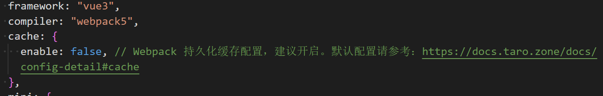
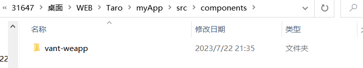

## Taro 安装及启动

[官网](https://docs.taro.zone/docs/next/GETTING-STARTED)

- npm:

```js {.line-numbers}
npm install -g @tarojs/cli
taro init myApp
cd myApp
npm i

```

- 编译为微信小程序

```js {.line-numbers}
 npm run dev:weapp
 npm run build:weapp
```

npm run dev 表示进入 watch 模式，自动监听 taro 文件的变化然后编译到微信小程序，但是这个启动会比较慢。npm run build 就表示直接进行编译

**关于 taro 强烈开启缓存的问题**

事实上开了这个以后，会出现编译问题，比如说微信开发者工具 not Found，然后热重载也无了，所以还是先选择关闭了。

## Taro 配置

### 编译配置

taro 使用的是 webpack，根目录下的/config 文件夹里是基础的编译配置，没什么需要改变的，就是后续引用 vant-weapp 的时候需要进行一些修改，

### 页面配置

每个 page 的结构就是遵循小程序那种，需要有 index.vue,index.js,index.config.js，虽然在 vue 中可以直接使用`definePageConfig` 省去 config.js，但是我还是遵循小程序的习惯，每个 page 都保留 page.config.js 了

### 全局配置

taro 全局配置在 app.config.ts 中，在这里可以配置 tabbar，window 等，具体看官方文档，常用的就是配置 tabbar。以下是我的配置

```js {.line-numbers}
export default defineAppConfig({
  pages: ["pages/index/index", "pages/index/profile/profile"],
  window: {
    backgroundTextStyle: "light",
    navigationBarBackgroundColor: "#fff",
    navigationBarTitleText: "WeChat",
    navigationBarTextStyle: "black",
  },
  tabBar: {
    color: "#999999",
    selectedColor: "#9a9afa",
    backgroundColor: "#ffffff",
    borderStyle: "black",
    list: [
      {
        pagePath: "pages/index/index",
        text: "首页",
        iconPath: "./image/home.png",
        selectedIconPath: "./image/home-selected.png",
      },
      {
        pagePath: "pages/index/profile/profile",
        text: "个人中心",
        iconPath: "./image/person.png",
        selectedIconPath: "./image/person-selected.png",
      },
    ],
  },
});
```

**config.ts**是 ts 的一些配置，没什么需要修改的，我在这里添加了一个别名@

```js {.line-numbers}
{
  "compilerOptions": {
    "target": "es2017",
    "module": "commonjs",
    "removeComments": false,
    "preserveConstEnums": true,
    "moduleResolution": "node",
    "experimentalDecorators": true,
    "noImplicitAny": false,
    "allowSyntheticDefaultImports": true,
    "outDir": "lib",
    "noUnusedLocals": true,
    "noUnusedParameters": true,
    "strictNullChecks": true,
    "sourceMap": true,
    "baseUrl": ".",
    "rootDir": ".",
    "jsx": "preserve",
    "allowJs": true,
    "resolveJsonModule": true,
    "typeRoots": ["node_modules/@types"],
    "paths": {
      "@/*": ["src/*"]
    }
  },
  "include": ["./src", "./types"],
  "compileOnSave": false
}
```

## vant-weapp 配置

Vant Weapp 组件库是有赞前端团队开源的支持微信小程序的移动端组件库。如果业务场景上，用 Taro 框架仅仅是来开发微信小程序的，不外乎直接使用 Vant Weapp 一定会比 Vant 更合适
在 Taro 中使用 vant 意味着失去了跨平台的能力，因为 vant 主要是针对微信小程序的组件库，而且在 taro 中配置 vant 还挺麻烦，不能直接 npm，然后再 app.config 里直接导出，而是需要一些比较麻烦的配置

[官方文档](https://docs.taro.zone/docs/vant/),和[一些博客](https://juejin.cn/post/7080176600704090143)

第一步就是设置黑名单，因为实际上 vant 组件直接使用是比较小的，因为是按照小程序标准转为了 rpx，所以直接 ban 掉就好，在 config/index.js 中设置

```js {.line-numbers}
mini: {
    postcss: {
      pxtransform: {
        enable: true,
        config: {
          selectorBlackList: [/van-/],//设置黑名单
        },
      },
      url: {
        enable: true,
        config: {
          limit: 1024, // 设定转换尺寸上限
        },
      },
      cssModules: {
        enable: false, // 默认为 false，如需使用 css modules 功能，则设为 true
        config: {
          namingPattern: "module", // 转换模式，取值为 global/module
          generateScopedName: "[name]__[local]___[hash:base64:5]",
        },
      },
    },
  },
```

第二步去 gayhub 上 clone 一份[vant](https://github.com/youzan/vant-weapp)的文件，将里面的`/dist`导入到`/src `里面的`components`中,当然其实直接 npm 了以后，在 node_modules 引入也是可以的，我这里遵循了官方文档，也比较方便


**第三步就非常重要了**，官方文档说 vant 组件中包含一些小程序原生文件的依赖，目前 Taro 没有对这些依赖进行分析。因此需要配置 copy 把这些依赖移动到 dist 目录中，例如需要 copy wxs 和样式文件，其实直接将 vant 的组件 dist 目录复制到编译文件夹就可以了，具体配置在`/config/index.js`中，以下是我的配置

```js {.line-numbers}
const path = require("path");
const root = path.resolve(__dirname, "..");
const vantPath = path.resolve(root, "src/components/vant-weapp");

const config = {
...
  sourceRoot: "src",
  outputRoot: "dist",
  alias: {
    "@": path.resolve(root, "src"),
  },
  plugins: [],
  defineConstants: {},
  copy: {
    patterns: [
      {
        from: vantPath,
        to: "dist/vant-weapp/dist",
      },
    ],
    options: {},
  },
  ...
}
```

然后我们就可以愉快的使用 vant 组件了~
具体使用的话需要在每一个 page 的 config.ts 中引入

```js {.line-numbers}
export default definePageConfig({
  navigationBarTitleText: "个人中心",
  enableShareAppMessage: true,
  usingComponents: {
    "van-button": "@/components/vant-weapp/button/index", // 使用vant组件
  },
});
```
