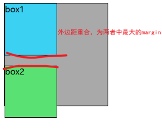
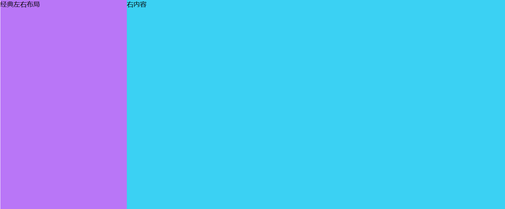
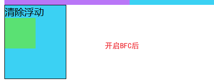

## 什么是 BFC

- 官方定义：BFC（Block Formatting Context）块格式化上下文， 是 Web 页面的可视 CSS 渲染的一部分，是块盒子的布局过程发生的区域，也是浮动元素与其他元素交互的区域。

- 说人话：BFC 就是页面上的一个隔离的独立容器，容器里面的子元素不会影响到外面的元素。 我们经常使用到 BFC，只不过不知道它是 BFC 而已，其实可以理解为一个黑盒子，最好理解的最常用的`position:absoulte`就是 BFC

## 如何创建一个 BFC

常用的方式有以下几种：

- 浮动元素（元素的 float 不是 none，指定 float 为 left 或者 right 就可以创建 BFC）
- 绝对定位元素（元素的 position 为 absolute 或 fixed）
- display:inline-block，display:table-cell，**display:flex**，display:inline-flex
- overflow 指定除了 visible 的值

## BFC 的特点

- 在 BFC 中，块级元素从顶端开始垂直地一个接一个的排列。（当然了，即便不在 BFC 里块级元素也会垂直排列）
- 如果两个块级元素属于同一个 BFC，它们的上下 margin 会重叠（或者说折叠），以较大的为准。但是如果两个块级元素分别在不同的 BFC 中，它们的上下边距就不会重叠了，而是两者之和。
- BFC 的区域不会与浮动的元素区域重叠，也就是说不会与浮动盒子产生交集，而是紧贴浮动边缘。
- 计算 BFC 的高度时，浮动元素也参与计算。BFC 可以包含浮动元素。（利用这个特性可以清除浮动）
- BFC 就是页面上的一个隔离的独立容器，容器里面的子元素不会影响到外面的元素。

### 两个盒子的 margin 如果有重合的话，解决重合冲突

- 比如说！
  
- 没开启 BFC 之前，这两个 margin 是会重合的，然后取 margin 最大的那个，在这里是 20px

```js {.line-numbers}
<div class="box">
  <div class="box-1">解决两者的margin差问题</div>
  <div class="box-2">box2</div>
</div>
.box {
      width: 200px;
      height: 200px;
      background: #aaa9a9;
      border: 1px solid;
      display: flex;
      /*flex-direction: column;*/
    }
    .box-1 {
      width: 100px;
      height: 100px;
      border: 1px solid;
      margin-bottom: 10px;
      background: #3bd1f3;
    }
    .box-2 {
      width: 100px;
      height: 100px;
      border: 1px solid;
      margin-top: 20px;
      background: #5ae173;
    }
```

- 开启了以后
  

```js {.line-numbers}
<div class="box">
  <div class="box-1">解决两者的margin差问题</div>
  <div class="box-2">box2</div>
</div>
.box {
      width: 200px;
      height: 200px;
      background: #aaa9a9;
      border: 1px solid;
      display: flex;
      flex-direction: column;
    }
    .box-1 {
      width: 100px;
      height: 100px;
      border: 1px solid;
      margin-bottom: 10px;
      background: #3bd1f3;
    }
    .box-2 {
      width: 100px;
      height: 100px;
      border: 1px solid;
      margin-top: 20px;
      background: #5ae173;
    }
```

### 2、制作两栏布局

BFC 的区域不会与浮动的元素区域重叠。

我们可以利用这个特性来创建 CSS 中常用的两栏布局（左边宽度固定，右边宽度自适应）。


```js {.line-numbers}
<div class="left"></div>
<div class="right"></div>

.left {
      width: 20vw;
      height: 70vh;
      float: left;// 开启bfc
      background: #b976f7;
    }
    .right {
      width: 80vw;
      height: 70vh;
      background: #3bd1f3;
    }

```

### 清除元素内部的浮动

这里清除浮动的意思并不是清除你设置的元素的浮动属性，而是清除设置了浮动属性之后给别的元素带来的影响。例如我们给子元素设置浮动，那么父元素的高度就撑不开了。

BFC 有一个特性：计算 BFC 的高度时，浮动元素也参与计算，利用这个特性可以清除浮动。



